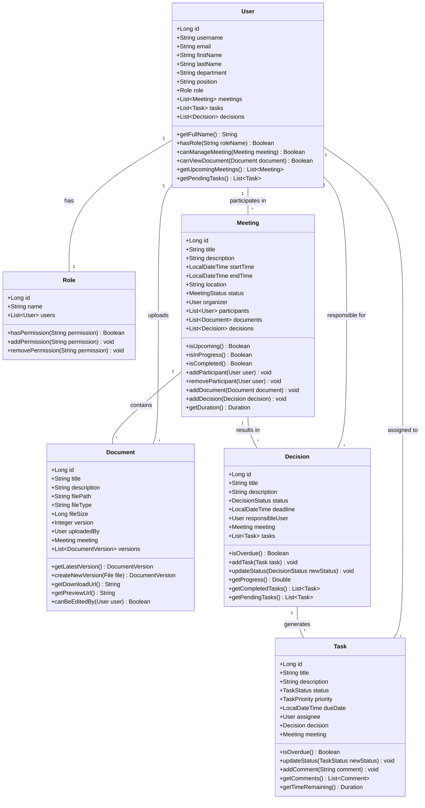

# Application Diagrams

## General Use Case Diagram

```mermaid
graph TD
    subgraph Actors
        Admin[Administrator]
        Manager[Manager]
        User[Regular User]
        Guest[Guest User]
    end

    subgraph Authentication
        Login[Login to System]
        Register[Register Account]
        ResetPassword[Reset Password]
        ManageProfile[Manage Profile]
    end

    subgraph Meeting Management
        CreateMeeting[Create Meeting]
        EditMeeting[Edit Meeting]
        DeleteMeeting[Delete Meeting]
        ViewMeetings[View Meetings]
        JoinMeeting[Join Meeting]
        ManageParticipants[Manage Participants]
    end

    subgraph Document Management
        UploadDoc[Upload Document]
        DownloadDoc[Download Document]
        ViewDoc[View Document]
        EditDoc[Edit Document]
        DeleteDoc[Delete Document]
        ShareDoc[Share Document]
    end

    subgraph Task Management
        CreateTask[Create Task]
        AssignTask[Assign Task]
        UpdateTask[Update Task Status]
        ViewTasks[View Tasks]
        TrackProgress[Track Progress]
    end

    subgraph Decision Management
        MakeDecision[Make Decision]
        TrackDecision[Track Decision]
        ViewDecisions[View Decisions]
        UpdateDecision[Update Decision]
    end

    subgraph System Administration
        ManageUsers[Manage Users]
        ManageRoles[Manage Roles]
        SystemConfig[Configure System]
        GenerateReports[Generate Reports]
        ViewLogs[View System Logs]
    end

    %% Actor Connections
    Admin --> SystemConfig
    Admin --> ManageUsers
    Admin --> ManageRoles
    Admin --> GenerateReports
    Admin --> ViewLogs

    Manager --> CreateMeeting
    Manager --> EditMeeting
    Manager --> DeleteMeeting
    Manager --> MakeDecision
    Manager --> AssignTask
    Manager --> UploadDoc
    Manager --> ShareDoc

    User --> ViewMeetings
    User --> JoinMeeting
    User --> ViewDoc
    User --> DownloadDoc
    User --> ViewTasks
    User --> UpdateTask
    User --> ViewDecisions

    Guest --> Register
    Guest --> Login
    Guest --> ResetPassword

    %% Authentication Connections
    Admin --> Login
    Manager --> Login
    User --> Login
    Admin --> ManageProfile
    Manager --> ManageProfile
    User --> ManageProfile

    %% Meeting Management Connections
    Manager --> ManageParticipants
    User --> ViewMeetings
    User --> JoinMeeting

    %% Document Management Connections
    Manager --> UploadDoc
    Manager --> EditDoc
    Manager --> DeleteDoc
    User --> ViewDoc
    User --> DownloadDoc

    %% Task Management Connections
    Manager --> CreateTask
    Manager --> AssignTask
    User --> UpdateTask
    User --> ViewTasks
    User --> TrackProgress

    %% Decision Management Connections
    Manager --> MakeDecision
    Manager --> UpdateDecision
    User --> ViewDecisions
    User --> TrackDecision

    style Admin fill:#f9f,stroke:#333,stroke-width:2px
    style Manager fill:#bbf,stroke:#333,stroke-width:2px
    style User fill:#bfb,stroke:#333,stroke-width:2px
    style Guest fill:#fbb,stroke:#333,stroke-width:2px
```

## Use Case Diagram

## Class Diagram

## Sequence Diagrams

### Authentication Flow

### Meeting Creation Flow

### Document Upload Flow

### Task Assignment Flow

### Decision Making Flow

### Report Generation Flow

