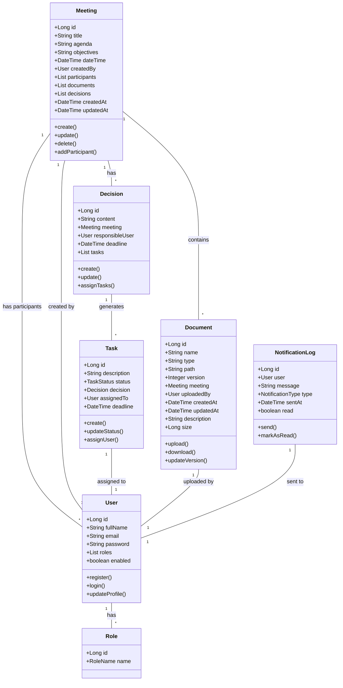
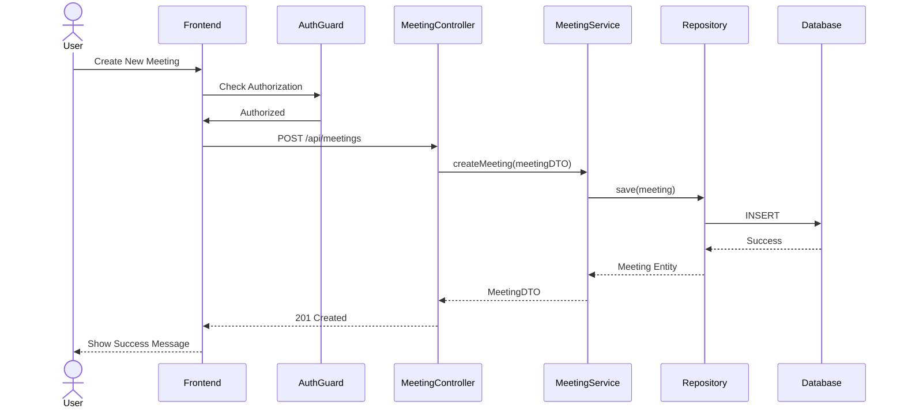
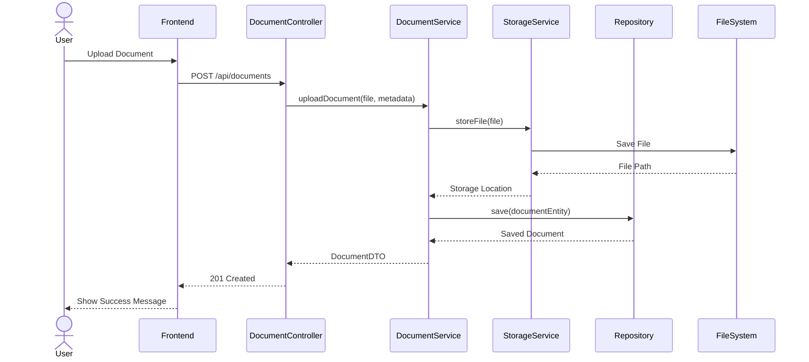
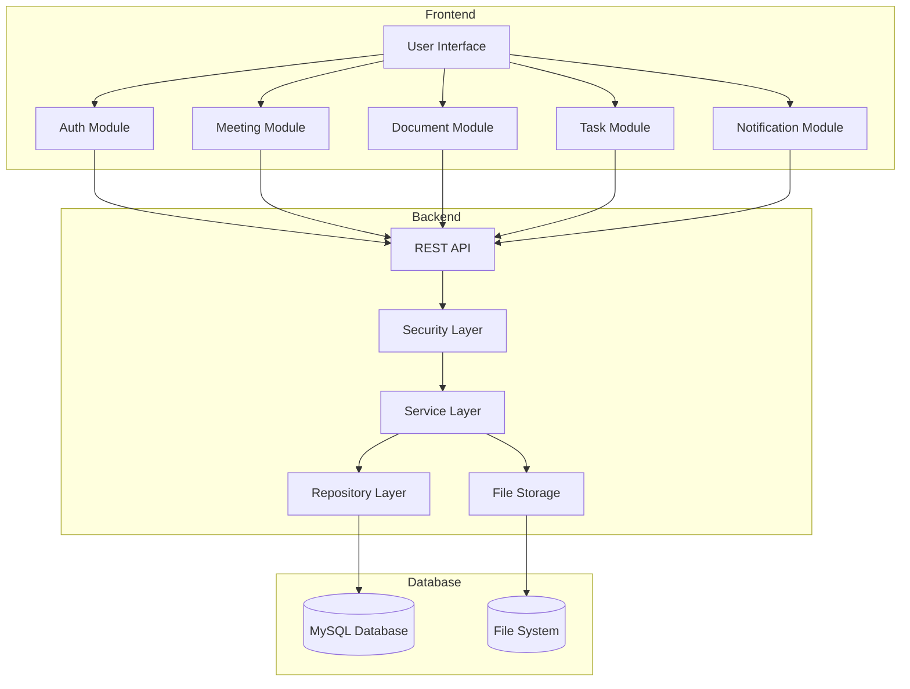
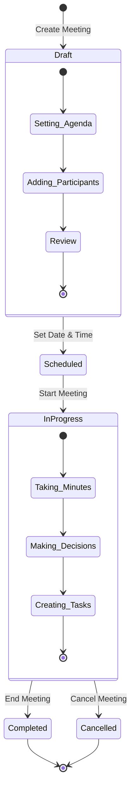

# Tunisair Meeting Management System - Architecture Diagrams

## Class Diagram

## Sequence Diagram - Meeting Creation

## Sequence Diagram - Document Upload with Versioning

## Use Case Diagram

```mermaid
graph TB
    subgraph Actors
        Admin((Admin))
        User((User))
        Secretary((Secretary))
        System((System))
    end

    subgraph Meeting Management
        M1[Create Meeting]
        M2[Edit Meeting]
        M3[Delete Meeting]
        M4[View Meetings]
        M5[Manage Participants]
    end

    subgraph Document Management
        D1[Upload Document]
        D2[Download Document]
        D3[Version Control]
        D4[Delete Document]
    end

    subgraph Task Management
        T1[Create Task]
        T2[Assign Task]
        T3[Update Status]
        T4[Track Progress]
    end

    subgraph Notifications
        N1[Send Notifications]
        N2[Read Notifications]
        N3[Configure Alerts]
    end

    %% Admin connections
    Admin -->|Can do all| M1
    Admin -->|Can do all| M2
    Admin -->|Can do all| M3
    Admin -->|Can do all| D1
    Admin -->|Can do all| D2
    Admin -->|Can do all| D3
    Admin -->|Can do all| D4
    Admin -->|Can do all| T1
    Admin -->|Can do all| T2
    Admin -->|Can do all| T3
    Admin -->|Can do all| N3

    %% User connections
    User --> M4
    User --> D2
    User --> T3
    User --> N2

    %% Secretary connections
    Secretary --> M1
    Secretary --> M2
    Secretary --> D1
    Secretary --> D2
    Secretary --> T1
    Secretary --> T2

    %% System connections
    System --> N1
```

## Component Diagram

## State Diagram - Meeting Lifecycle
